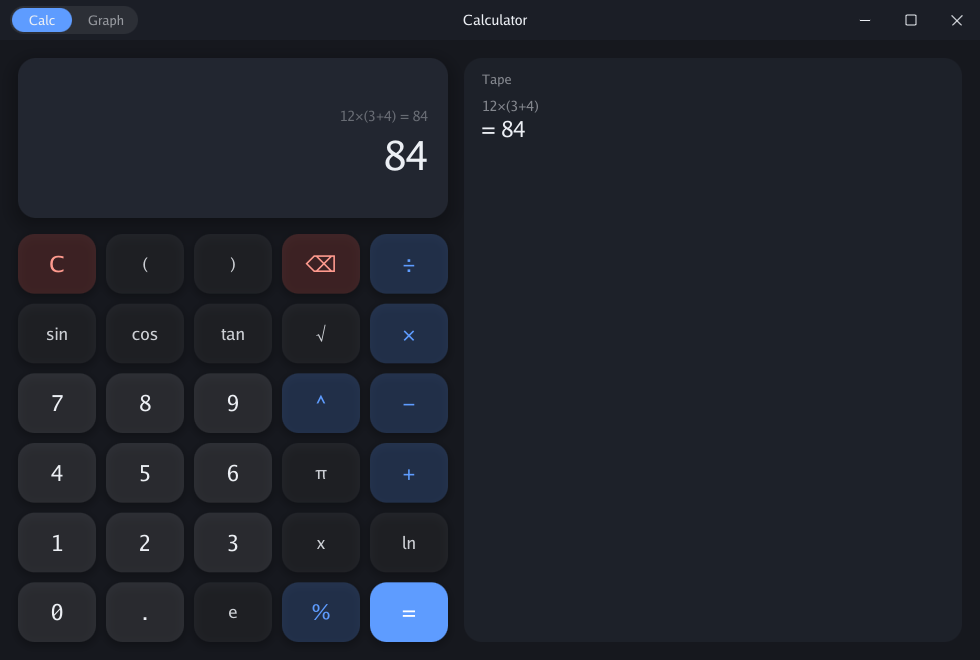
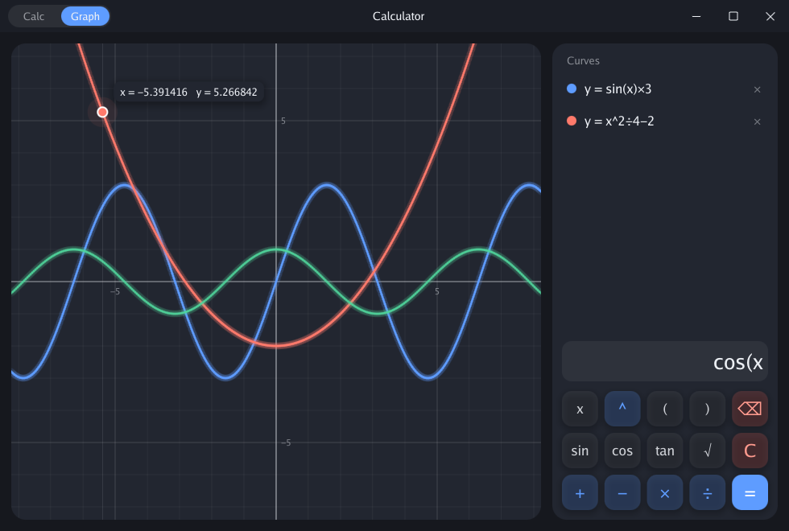
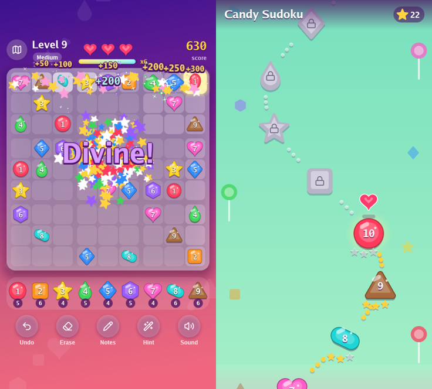

# gunim

An animation-first GUI framework for Go. Pure Go, GPU rendered, driven by
the display's refresh rate.

## Status

gunim runs on Windows 11, on Linux under X11, and on Android. On Windows
each window draws at its own monitor's rate, with 60 Hz and 120 Hz
monitors side by side. macOS builds and is still untested. The API
still changes as the examples ask more of it.

Text shapes and wraps in pure Go, including right-to-left and mixed
scripts. Sound plays in pure Go on the desktop. The examples below are
full programs: a music player, a file manager, a calendar, a chat
client and a candy sudoku among them.

`example/twowindows` is where gunim started: two windows, each
animating a rounded rectangle on its own render thread, built with
`CGO_ENABLED=0`.

```sh
CGO_ENABLED=0 go run ./example/twowindows -for 5s
```

## Examples

`example/tutorial` teaches how to build a gunim application, six
lessons in a window: the node tree, a button and the two halves, a
keyed list, a node of your own, themes, and a dialog. Each lesson has
something to try, and its own source in a code editor under it. Edit
the source and press Run: the tutorial builds again with the file as
edited and opens on that lesson, and a build error marks its line.
[example/tutorial/README.md](example/tutorial/README.md) walks the
same lessons in prose.

```sh
CGO_ENABLED=0 go run ./example/tutorial
```

`example/calculator` shows the animation: a calculator with a graph, in
a window that draws its own title bar.

```sh
CGO_ENABLED=0 go run ./example/calculator
```

Keys squash and spring back with a ripple, typed digits roll into the
display, and a sum worked out flies in an arc to the tape. On the graph,
curves draw themselves on, the one being typed morphs with each key, the
grid thickens and thins as the wheel zooms, a flick coasts, and a dot
traces the curve under the pointer on a spring. A sum with no answer
sends a red echo out past the window's edges, onto the desktop, and a
curve kept on the graph a green one.




`example/chat` is a chat client with a pretend server behind it, for trying the widgets in a chat. The
timeline opens at its latest message and stays there as messages arrive. Colleagues type, reply, edit and withdraw,
some sends fail, and the button in the header drops the connection so messages wait until it is back.

```sh
CGO_ENABLED=0 go run ./example/chat
CGO_ENABLED=0 go run ./example/chat -history 50000
```

`example/calendar` is a calendar with a pretend back end, built on the `calendar` package: a day, a week or a
month, events that repeat, and invitations from colleagues. Drag on free time to draw out an event, drag an event
to move it, and drag its bottom edge to change its length.

```sh
CGO_ENABLED=0 go run ./example/calendar
```

`example/files` is a file manager that does real work: it copies, moves,
renames, makes folders, and moves items to the trash, each in the
background with progress, cancel and undo. It is a thin program over the
`filemanager` package, which any gunim program can open on a file system
of its own, such as a server's, with its own places and favourites.

```sh
CGO_ENABLED=0 go run ./example/files
CGO_ENABLED=0 go run ./example/files -demo
```

`-demo` opens a folder of sample files made in a temporary folder, and
keeps its settings there too. Going into a folder slides its listing in
from the right, and going back slides it in from the left. The preview
crossfades between items, the progress panel slides up while something
runs, and each finished operation leaves a toast with Undo. A folder of
a hundred thousand files lists in the background and scrolls at once,
as the grid draws only the rows in view.

Ctrl+2 shows a folder as icons, and each row flies to its tile. Pictures
show thumbnails, decoded in the background for the tiles in view. Space
opens a picture large: it grows out of its tile, the arrow keys slide
to the next, the wheel zooms about the pointer, and Escape flies it back.

Items drag as a stack of cards that trails the pointer and says what a
drop will do: move or copy to the folder under it, pin it to the
favourites, or nothing, with a shake. A folder the drag rests on springs
open. Files drag between windows, out to other programs, and in from
them; files from another program light the folder they would drop in
while they are still being dragged. On Windows an item drags from a window lying behind another, which
stays behind, as Explorer's do; a click there brings the window to the
front. Ctrl+N opens another window on the same folder.

`example/music` is a music player, for gunim's sound and animation
together. The track playing is a picture disc that spins while it plays
and runs down slowly as it pauses, ringed by bars that move with the
music, pitch by pitch. Lights in the cover's colours drift behind
everything and swell with the bass, and a new track's colours flow
through the whole window, up under its title bar. The seek bar is the
track itself, drawn as its loudness along it.

```sh
go run ./example/music
go run ./example/music -dir ~/Music
```

It always has four songs made in code, so it plays anywhere. Its
library follows folders of MP3, FLAC, Ogg Vorbis and WAV files, with
their tags and covers: tracks copied in join it within seconds, and
tracks deleted leave. It follows your music folder from the first run,
and `-dir` or the library's Add a folder adds more. Playlists gather
tracks by hand, and their rows move by their grips. The library and the
playlists are kept between runs. Up next holds the tracks to play
before the list goes on. Tracks drag from their rows, and files drag in
from a file manager, and each drops where it is let go: on the track
playing, to play now or join Up next; on a playlist or Up next, to join
it at the gap shown; or on the library, which follows a folder dropped
there. A drag resting on a list's back button slides it away, to drop
on the shelf. The equalizer, E, is parametric: up to
eight bands, each a bell, a shelf, a cut or a notch, dragged about a
graph, with the sound's spectrum before and after it drawn behind them.

Loudness gain plays each track, or each album played in order, at -18
LUFS, measured in the background and kept between runs. Its button
steps between no gain, track gain and album gain, and two tracks
crossfading each keep their own. The volume bar shows the gain as the
pointer comes over it, and I opens a card of the track's file, quality
and loudness. Space plays and pauses, the arrows seek and set the
volume, N and P skip, S shuffles and R repeats.

The system's media controls show the track playing, with its cover, and
play, pause, skip and seek it. The window's title names the track, so
Alt+Tab and the taskbar show it. The window opens where it last closed,
on a monitor still attached, and fades out with the music as it closes.


[Marras Mastering Studio](https://github.com/marrasen/mastering-studio)
masters an album, an EP or a single, through chains of VST3 plugins. It
started here as `example/mastering` and is now a project of its own,
built on gunim's `audio`, `audio/vst3` and `audioui`.

`example/sudoku` is a sudoku of candies, made for a phone and laid out
for a desktop too, to see how far the animation goes. Each digit is a
candy of its own colour and shape. Candies drop in and wobble like
jelly; a wrong one shakes, crumbles and breaks a heart as the board
shakes; a finished row sweeps with light; quick candies build a combo
that calls out "Sweet!" with stars; a won board bounces under fireworks.
Picking a candy sets every candy of its digit hopping, a new level's
candies run in and leap into their cells, and after a win Pac-Man eats
the board row by row. Each digit is a note on a marimba, so filling the
board plays tunes. The music is a song in ten synths, each coming and
going in 16-bar phrases, so it never plays the same twice. A map winds
through 60 levels, from Easy to Expert, in three layers that scroll at
their own speeds, and a heart hops along it as each level opens.

```sh
go run ./example/sudoku
```

Tap a cell, then a candy; or a candy, then each cell it goes in. On a
desktop the arrows move, digits place, and Shift with a digit pencils a
note. Progress is kept between runs.



Three smaller examples show one thing each. `example/widgets` is a
gallery of the widgets, with a dark and a light theme to switch
between. `example/controls` has popups, pictures that fly to fill the
window, a list of a hundred thousand items, rows to put in order by
dragging, and a second window to drag pictures to. `example/paragraph`
springs a column of English, Hebrew and Arabic between narrow and wide,
wrapping it again every frame.

```sh
CGO_ENABLED=0 go run ./example/widgets
CGO_ENABLED=0 go run ./example/controls
CGO_ENABLED=0 go run ./example/paragraph
```

## Sound

Package `audio` plays sound: a `Mixer` sums the sounds playing into one
stream at 48 kHz, and `audio/speaker` plays it through the computer's
speakers, in pure Go on Linux, Windows and macOS. A voice's volume and
pan move with `anim`'s springs and tweens, stepped in time with the
sound. `Decode` reads WAV, MP3, Ogg Vorbis and FLAC, and an MP3 drops
its encoder's silence, so an album plays without gaps. An `Analyzer`
measures the sound as it is heard, for visuals that keep time with it,
and its `Spectrum` reads the sound before a voice's inserts as well as
after. An `EQ` is such an insert: a parametric equalizer of bells,
shelves, cuts and notches, whose bands glide to new settings without
clicks. A `LoudnessMeter` measures integrated loudness in LUFS as
ITU-R BS.1770 defines it, as EBU R128 and ReplayGain 2 use it, and
`FormatOf` says what a decoded sound was stored as, an `FFT` takes a
sound's spectrum block after block, and a `WAVWriter`
writes 16 or 24-bit WAV, dithered, or 32-bit float, tagged. Its `Range` reads
the loudness range, LRA, as EBU Tech 3342 defines it, and several
sounds' readings pooled measure an album as one.

Package `audio/vst3` hosts VST3 plugins, in pure Go. It finds the
plugins in the system's folders and loads one. It runs stereo sound
through an effect in realtime or offline, and saves and restores its
state. It shows the effect's own editor in a window, on Windows and
Linux.

Package `audioui` draws sound for audio programs: level meters and
faders, a spectrum and a spectrogram, a waveform, and loudness readings
and curves, in the colours of a dark studio.

`audio/speaker` plays through a fork of oto,
[marrasen/oto](https://github.com/marrasen/oto), which keeps a
Bluetooth headset on Android from crackling and says how long the
device takes to play what it is handed, so visuals keep time with the
sound as heard. Go applies a `replace` only in the module being built,
so a program that imports gunim takes the same line into its own
`go.mod` to get the fix:

```
replace github.com/ebitengine/oto/v3 => github.com/marrasen/oto/v3 v3.5.1-gunim.2
```

Widgets play cues as the user works them: a press, a switch turning on
or off, a menu opening. They are silent until an application chooses
the sounds; `audio/cues` has a quiet set made in code:

```go
mix := audio.NewMixer()
if _, err := speaker.Open(mix, speaker.Options{Name: "My app"}); err == nil {
	app.SetCues(cues.New(mix))
}
```

`example/widgets` plays them; `-sound=false` turns them off.

An application plays cues of its own with `UI.Cue`, for what happens
while the user looks elsewhere: `CueConnected` and `CueDisconnected`,
`CueDone` and `CueFailed` for work left running, and `CueBell` for
something that wants the user, as a terminal's bell. Each cue sounds
from where its node is across the window, a little left or right.

## The desktop

A window looks finished with no work from the application. By default
gunim draws its title bar, rounded corners, border and shadow, and the
window fades in as it opens and fades out as it closes. An application
that puts `widget.WindowControls` in its own tree draws its own title
bar instead. `WindowOptions.SystemFrame` keeps the system's frame, and
`WindowOptions.Instant` turns the fade off.

`WindowOptions.UnderTitleBar` lets an application draw the whole
window, with gunim's title bar over its top, the way an Android app
draws under the status bar. The bar's height comes to the application
as `Frame.Safe`, as a phone's bars do, so the same layout keeps its
content clear of both. A `widget.TitleBar` with a `Name` shows that
name whatever the window's title says, and `TitleAtStart` puts it at
the left.

`Window.Placement` says where a window is and how big, for the
application to keep as it closes, and `WindowOptions.Place` opens it
there next time. A placement whose monitor is gone opens centred on the
primary monitor, and one larger than its monitor shrinks to fit. A
window also goes full screen, stays above other windows with
`WindowOptions.Pinned`, zooms with Ctrl and +, - and 0 or the wheel
with `WindowOptions.ZoomKeys`, and asks for the user's attention in the
taskbar.

An application reaches the rest of the desktop through `App`, `Client`
and `UI`:

- **The tray.** `App.SetTray` shows an icon with a menu, and
  `App.TrayNotify` a message from it. With `App.StayOpen` the
  application runs on with no window open. Linux speaks
  StatusNotifierItem.
- **Keys from every program.** `App.RegisterHotKey` hears a key
  whatever program has the keyboard, on Windows and on X11.
- **Media controls.** `App.SetNowPlaying` tells the system what plays,
  over MPRIS on Linux and the System Media Transport Controls on
  Windows. Their buttons arrive as media keys, and a move along their
  bar as `input.MediaSeek`.
- **Files.** `Client.ChooseFiles` and `Client.SaveFile` show the
  system's dialogs. `Client.Open` hands a file to the program the
  system keeps for it, and `Client.Reveal` shows it in the system's file
  manager.
- **The clipboard.** `UI.SetClipboard` and `UI.ReadClipboard` carry
  text, and `UI.ClipboardImage` reads a picture.
- **Drag and drop.** Files and pictures drag between windows, out to
  other programs and in from them, and a drop target lights while
  another program's files hover over it. With
  `WindowOptions.DragFromBehind`, an item drags from a window lying
  behind another on Windows, as from Explorer's windows.

## Android

The same programs build for Android. `tools/gunimapk` turns one into an
APK with the Android SDK's own tools, and `-run` installs and starts it
on the device or emulator adb sees. `-name` and `-icon` give it a label
and a launcher icon:

```sh
go run ./example/calculator -icon calc.png
go run ./tools/gunimapk -run -name Calculator -icon calc.png ./example/calculator
```

Android loads a Go program as a library, which needs cgo, so the
Android build uses cgo and the NDK's compiler. The desktop builds stay
pure Go.

A tap is a click, and a popup opens over the window that opened it. A
finger that moves scrolls what it came down on and flings as it lifts,
unless what it pressed drags by touch, as a slider or the calculator's
plot does. Two fingers pinch to zoom whatever zooms with Ctrl and the
wheel. A finger held still is a right click, which opens a context
menu; in text it selects a word, drags on over more words, and shows
handles for the selection's ends and the edit menu.

An application asks the user for a permission with `App.Ask`, as
`driver.PermissionMusic` to read their music: Android's prompt asks,
and a desktop has it already. `gunimapk -permissions music` declares
what the APK may ask for. `App.UserFolder` finds the user's Music
folder, on a phone or a desktop, and a folder chooser picks a folder on
the phone's storage or a card as a path.

A tap on a text field opens the soft keyboard, whose edits, autocorrect
and composition reach the field as `input.TextEdit`s, and the window
slides up with the keyboard to keep the field in view.
[driver/android](driver/android/android.go) says how it fits together.

The examples lay themselves out for a phone where the window is narrow;
the calculator and the chat take `-size 390x800` to try it on the
desktop.

## The split

A gunim program is two halves that speak only in values.

The **window** owns the widget tree, the springs, the focus ring, and
how a dialog arrives and leaves. The **application** owns the work.
Between them run commands one way and intents the other, and every one
of them is a plain value.

```go
// Window half: the wiring is data.
b := widget.NewButton("Delete everything")
b.On = DeleteRequested{Target: "everything"}

// Application half: reached only through Client, which returns at once.
c.Mount(gunim.Root, "confirm", "confirm", ConfirmState{Title: "Delete everything?"})
```

That keeps application code off the goroutine that draws frames, by
construction: the application holds a `Client`, and a `Client` takes
values, so values are all it can hand the window.

In one process those values cross as they are, uncopied, so a state
holding an image gives the window the image itself.
The price is the rule channels already teach: sending a value hands it
over, so leave it unchanged afterwards.

Both halves are Go, so one type declaration serves them both, and
`CheckWire` proves in a test that each one would also survive a socket.
Put a socket transport where the queue is, and the application moves
to another machine with both halves unchanged.

Local interaction stays local. A dialog closes itself on the frame the
button is released, and tells the application afterwards.

### What the split gives every application

Each of these comes from the split itself, so every gunim application
has it with no code of its own:

- **A window out of sight rests while the application works on.** A
  window draws nothing and holds its animations while it is minimized,
  covered whole by other windows, on another virtual desktop, on a
  screen that is off or locked, or in a phone application gone to the
  background. The application half runs apart from the frames, so music
  keeps playing, timers keep firing and files keep loading. Back in
  sight, the window draws the latest state at once. The application
  hears of a window minimized, as `input.WindowHidden`, and goes on
  unaware of one merely covered.
- **The window stays smooth while the application is busy.** Slow
  disks, networks and long computations happen in the application half,
  and the window keeps drawing at the display's rate meanwhile.
- **The application pushes state as fast as it likes.** The window
  draws only the latest state each frame; see [Push as hard as you
  like](#push-as-hard-as-you-like).
- **Interaction answers on the next frame.** A press, a drag or a
  dialog closing happens in the window, and the application hears of it
  afterwards.
- **Each half is tested on its own.** Tests drive the application half
  with intents and read the state it publishes, and drive the window
  half with input and state in an offscreen window, frame by frame.
- **The application can move to another machine.** The halves trade
  plain values, so a socket can carry them; see above.

## Topics and patches

Views watch topics. One publish reaches every view showing that data.

```go
c.Mount(gunim.Root, "jobs",    "joblist",  nil, "jobs")   // watches "jobs"
c.Mount(gunim.Root, "sidebar", "jobcount", nil, "jobs")   // watches it too

c.Publish("jobs", JobList{Jobs: jobs})                    // both update
c.Patch("jobs", JobProgress{ID: id, Progress: 0.4})       // one spring retargets
```

`Publish` and `Patch` draw the same line aprot draws between a refresh
trigger and `PatchSubscription`, and here that line is an animation
distinction: **a publish reconciles structure, a patch retargets a
value.** An aprot refresh lands as a `Publish`, and a pushed patch lands
as a `Patch`.

`Update(id, state)` is `Publish` to the topic named after a view's own
ID, so there is one delivery path.

## Push as hard as you like

`Client.Send` returns at once and never blocks on the window. The
application pushes at whatever rate it produces state, and the window
draws once per display refresh.

Two things make that true. A window keeps one frame in flight and
draws the next only once the display has taken it, so the display sets
the rate. And a `Publish` that a later
one supersedes is replaced in the queue before it ever reaches a view,
so 101 publishes between two frames cost one reconciliation:

```go
for i := range 100 { c.Publish("jobs", state[i]) }
c.Publish("jobs", latest)
// one frame, one view update, and latest is what it renders
```

`Patch` is left alone, because two patches on one topic may aim at
different rows. Coalescing also stops at `Mount`, `Unmount` and `Focus`,
so state queued ahead of one still reaches the views that were already
there.

`Window.Stats()` reports `Frames`, `Commands` and `Coalesced`, so the
behaviour is something you can check rather than trust.

## Keyed lists

Published state is worth animating only if the list can tell what
changed. `Sync` does that from keys.

```go
widget.Sync(l, u, s.Jobs,
    func(j Job) widget.Key { return widget.Key(j.ID) },
    newJobRow,
    (*jobRow).Set)
```

A row that arrived grows into place. A row that went collapses while its
neighbours close the gap. Everything else springs to where it belongs
now. A row that comes back mid-exit is revived with the velocity it had.

## The three ideas

**The engine owns the widget tree and runs each node through a
lifecycle.** A node is `Entering`, then `Present`, then `Exiting`. Remove
a dialog and it moves to `Exiting`, animates itself out, and tells the
engine when to unlink it. Put it back mid-dismiss and it reverses,
keeping its velocity. Over the wire that is `Mount` with the ID of a
view that is still leaving.

**Animation runs on wall-clock time.** Every frame carries a timestamp
and a delta, so motion looks the same at 60 Hz, at 144 Hz, and across a
dropped frame.

**A window draws while something moves, and sleeps the rest of the
time.** Each node reports whether its values are still in flight. Once
they all report settled, the window blocks until the next keystroke or
click.

## What a widget looks like

```go
func (d *Dialog) Transition(p gunim.Presence, f gunim.Frame) bool {
    switch p {
    case gunim.Entering:
        d.in.Animate(1, Bounce.Get(f.Theme))
    case gunim.Exiting:
        d.in.Animate(0, Settle.Get(f.Theme))
    }
    return !d.in.Active()
}
```

That is the whole exit-animation contract. The engine calls `Transition`
every frame while the node is entering or leaving. `Animate` ignores a
target it is already heading for, so the repeated call is free.

## Themes

A theme sets how widgets look and move: colours, but also paddings,
radii, fonts, text sizes and the springs that animations run on. A widget
declares each value as a token with a default, and reads it every frame:

```go
var ButtonPadding = theme.Length("button.padding", 16)

size := run.Advance + 2*ButtonPadding.Get(f.Theme)
```

A theme gives tokens values, and a window keeps one animated value per
token. Switching themes retargets them all, so going from dark to light
moves colours, sizes and motion together:

```go
w.RegisterTheme(widget.Light())
c.SetTheme("light")
```

Widgets animate state and look up style: a button animates how hovered
it is, from 0 to 1, and blends the theme's idle and hover colours by it
each frame. A theme switch in the middle of a hover then just works.
`example/widgets` switches between a dark and a light theme with the
Switch theme button in its header.

Colours blend through Oklab, so a switch keeps its brightness and its
hues. Text colours are declared with `theme.Foreground`: they fade out
in the old colour and back in with the new one. Text and background
swap brightness in a dark-to-light switch, and fading through keeps
the text from smearing into a matching grey where they cross.

A subtree can wear a theme of its own. `widget.NewThemed(child, th)`
sets th's tokens inside it, and the rest come from the theme around it
and move with it:

```go
callout := widget.NewThemed(card, theme.Make("callout",
    theme.Set(widget.CardFill, blue),
    theme.Set(widget.Ink, white)))
```

## Encoding

Encoding belongs to a socket transport. It calls `MarshalCommand` and
`MarshalEnvelope`, which use `encoding/json/v2` with one set of options
in `codec.go`:

```go
var wireOptions = json.JoinOptions(
	json.OmitZeroStructFields(true),
	json.Deterministic(true),
)
```

`OmitZeroStructFields` is why this repo has zero struct tags. A zero
field is left out and comes back zero, with no annotation on it. v2
matches member names case-sensitively, so the Go field name is the wire
name. Each carried value goes with the name `RegisterType` gave it, so
the far end knows what to decode it into:

```json
{"Command":"mount","Parent":"root","ID":"jobs","View":"joblist","Watch":["jobs"],"Value":{"Kind":"job.list","Data":{"Jobs":[{"ID":"1","Title":"Reindex archive","Status":"pending"}]}}}
```

## Icons

Package `icon` holds Lucide's icons, one variable each, named as
lucide-react names them: `icon.Funnel`, `icon.Columns3`, and older names
such as `icon.Filter` and `icon.Loader2`. A program links only the icons
it uses; `icon/byname` looks any of them up by name, and links them all.

```go
refresh := widget.NewIconButton(icon.RefreshCw, "Refresh") // the tooltip names it
copyBtn := widget.NewButton("Copy")
copyBtn.Icon = icon.Copy
spinner := widget.NewIcon(icon.Loader2, "Loading")
spinner.Spin = true
done := widget.NewIcon(icon.CircleCheck, "Saved")
done.DrawOn(600 * time.Millisecond) // strokes draw on in order
```

An icon is strokes, drawn as a coverage mask. The mask is rasterized
once per icon, pixel size and stroke width, and kept in the glyph
atlas. It is tinted as it draws, so a theme's colour animates without
drawing it again. Links, menus, drop-downs, tabs, chips, the palette, dialogs
and rich text take icons too. A text field shows one at its start, and
`Clearable` gives it an X that empties it. A toast's `Kind` picks an icon
that draws itself on as the toast arrives. The widgets' own marks, such
as a menu's tick, a drop-down's chevron and a chip's cross, are Lucide
icons too. `go generate
./icon` with `LUCIDE_REACT` set to a lucide-react package directory
writes them again from a newer Lucide.

## Packages

| Package | What it is |
| --- | --- |
| `gunim` | `Node`, the presence lifecycle, the window and its frame loop, and its zoom with Ctrl and +, - and 0 or the wheel |
| `gunim/anim` | `Animated[T]`, springs, tweens, easings |
| `gunim/audio` | A mixer, voices with animated volume and pan, clips, decoders for WAV, MP3, Ogg Vorbis and FLAC, and an analyzer for visuals |
| `gunim/audio/speaker` | Plays a mixer through the speakers, with oto |
| `gunim/audio/cues` | Quiet sounds made in code for the widgets' cues |
| `gunim/audio/vst3` | Hosts VST3 effects: their sound, state, parameters and editors |
| `gunim/audioui` | Meters and faders, a spectrum and a spectrogram, a waveform, and loudness readings for audio programs |
| `gunim/paint` | The per-frame draw list: rounded rects, shadows, text, images, tinted masks, layers |
| `gunim/icon` | Lucide's icons as strokes, drawn as tinted masks; `icon/byname` looks them up by name |
| `gunim/geom` | float32 points, sizes, rectangles |
| `gunim/syntax` | Splits source code into tokens to colour; `syntax.Go` reads Go with `go/scanner` |
| `gunim/markdown` | Shows Markdown as gunim text that the reader can select and copy |
| `gunim/match` | Finds a typed query in lines of text, ranked as a command palette ranks them |
| `gunim/emoji` | The emoji in a picker's groups, with their names for searching |
| `gunim/input` | Pointer, keyboard and focus events, keys, buttons, modifiers |
| `gunim/theme` | Tokens, themes, and animated theme switching |
| `gunim/text` | Fonts and fallback, shaping, paragraph layout, glyph rasterizing |
| `gunim/access` | What a window says to screen readers: roles, names, states, actions |
| `gunim/driver` | The seam with the operating system, and an offscreen window |
| `gunim/driver/desktop` | The driver for Linux, Windows and macOS, on GLFW and OpenGL |
| `gunim/driver/android` | The driver for Android: every window drawn into the activity's one surface, touch, and the soft keyboard |
| `gunim/gunimtest` | Offscreen windows for tests, which fail a test that sent from or focused a node out of the tree |
| `gunim/filemanager` | A file manager to open in any program, on the local disk or on a file system of its own, such as a server's |
| `gunim/calendar` | A calendar's views: a day or a week by the hour, a month, and a small month to pick a day from |
| `gunim/widget` | `Row`, `Column`, `Scroll`, a `TileGrid` that builds only the tiles in view and selects with a band, `Label` whose text the mouse can select and copy when `Selectable`, `TextField`, `NumberField` that steps with the arrows and the wheel and holds itself to its bounds, `TextArea`, `Card`, `Button`, `Icon`, `IconButton`, `Checkbox`, `Switch`, `Slider`, which runs up the height as a fader when its `Axis` is vertical, `Tabs`, a `Segmented` control whose pill springs to the option chosen, `Dropdown`, `ContextMenu`, `Tooltip`, `Image`, `Hero` for elements that fly between screens, `Draggable` and `DropTarget` for drag and drop within and between windows and to and from file managers, a `DragGhost` that trails the pointer and says what a drop would do, a `DropZone` that lights the spot under a drag and springs it open, `Dialog`, a keyed `List`, a `VirtualList` that builds only the rows in view, a `DataGrid` that draws millions of rows of styled cells by index and drags the rows selected, an `Overview` strip that maps and scrolls it, a `MenuButton` whose menu can stay open to tick several items, removable `Chip`s and a `Wrap` that flows them onto lines, `RichText` that wraps text in several styles with links, a `CodeEditor` with line numbers, tab stops, highlighting and marks such as a compiler's errors, and their theme tokens |

Commands, intents, topics and the `Client` live in `wire.go` and
`view.go`. `driver.Offscreen` plus `Window.Frame` run a window with no
display, which is how the tests step an interface a frame at a time.

A node implements `Node`, which is `Layout` and `Paint`. Three further
interfaces are opt-in: `Handler` for input, `Animator` for animated
values, `Transitioner` for enter and exit.

## The platform layer

gunim takes it from Ebitengine 2.10, which ships a complete
reimplementation of GLFW in pure Go: X11 with GLX and EGL on Linux and
the BSDs, Win32 with WGL on Windows, Cocoa with NSGL on macOS, all
through purego. Its window constructor is the real GLFW one,
`CreateWindow(w, h, title, monitor, share)`, so several windows, a chosen
monitor and shared GL objects are all available down there. Ebitengine
confines itself to a single window in `internal/ui`, one layer up, and
that is the layer gunim replaces.

`internal/glfw` and `internal/gl` are copies of Ebitengine's, with the
changes listed in `internal/README.md`. The main one tracks the current
GL context per thread, so each window can render on a thread of its
own. Another adds a popup window: one the window manager leaves where
it is put, which never takes the keyboard.

`driver/desktop` pumps GLFW events on the main thread, and gives each
window a render thread that owns its GL context. The render thread
replays the frame's `paint` ops, swaps buffers, and reports the frame
shown once the swap returns. That report is what paces the window, so
two windows on two monitors keep two refresh rates. On Windows, GLFW's
swap waits for the compositor, which follows the fastest monitor, so
each render thread waits for its own monitor's vertical blank instead,
the way Chromium does. Where the swap does
not wait for the display, as under a remote desktop, the render thread
sleeps out the rest of the refresh itself.

On Windows the frames reach the screen through DXGI, as Direct3D
programs' do: the renderer draws with OpenGL into a Direct3D 11 texture
shared through `WGL_NV_DX_interop2`, and a flip-model swap chain shows
it through DirectComposition. That path works on every display,
including one Windows puts in place of a monitor that is switched off,
and over remote desktop tools. Where a machine lacks a piece of it, the
window presents through OpenGL, and `GUNIM_PRESENT=gl` chooses that
too.

Every shape is one quad and one signed distance field, so rounded
rectangles, strokes, gradients and shadows stay crisp at any scale.
Shapes, glyphs, images and layer composites all go through one shader
program, and each vertex carries what its pixels need, so a run of ops
is one draw call: the widgets gallery draws in three. Every window
shares the one program, built once. A layer draws into an offscreen
texture and is composited back with its opacity and rounded clip.

The painter compares each frame with the one before, and the driver
redraws only the part that changed into a canvas it keeps, then copies
the canvas to the window. A button easing into its hover colour costs
the button. Images upload to the GPU once, with mipmaps, and stay while
frames draw them. A layer's `Blur` and `Backdrop` are Gaussian
blurs, run at half or a quarter of the resolution when they are wide.
Text is shaped and wrapped by go-text/typesetting, a
pure-Go port of HarfBuzz, and drawn from a glyph atlas, shared by every window, that keeps four
quarter-pixel shifts of each glyph, so text sits sharp at any
fractional position. While a transform scales it, as when a dialog
grows into place, the glyphs keep their resting size and scale with
the quads, and they sharpen again when the motion settles.

Small text is hinted: each glyph's baseline, x-height, cap height and
the tops and bottoms of its strokes land on whole pixels, while widths
and positions across stay as shaped. Where Windows has ClearType on,
glyphs are drawn on the panel's red, green and blue subpixels, and
the shader blends each channel on its own. Text that is scaled or
rotated, that fades in a layer, or that sits in a transparent window
is drawn in greyscale. Linux and macOS get greyscale by default.
`WindowOptions.Text` chooses otherwise.

A character the font lacks comes from the face's fallbacks, then from
the fonts installed on the system, found on first need. So Hebrew,
Arabic or Japanese show wherever a font for them is installed, with no
font shipped by the application. `text.ParseCollection` reads `.ttc`
collections, which is how Windows ships most of its Chinese, Japanese
and Korean fonts.

Menus, drop-down lists and tooltips open in popup windows, so they
reach past the edge of the window that opened them. A popup's content
is an ordinary node in the opener's tree, run by the same goroutine,
and it animates in and out like any other. The popup opens below its
anchor, or above where the screen runs out. Where the display server
blends windows, it has round corners and a shadow.

Screen readers can read and use a window. A node that means something
to a person, such as a button, says what it is, and the engine gathers
what the drawn nodes say into a tree after each frame, while a screen
reader listens. On Linux the driver answers over AT-SPI, which Orca
reads: the tabs, fields, checkboxes, sliders and buttons of the
examples read out, and a screen reader can press, check, set and move
focus through them. On Windows it answers UI Automation, which
Narrator reads, on 64-bit Windows. macOS comes later.

A Go program for Windows is a console program, and started from
Explorer or a shortcut it gets a console window of its own. The driver
lets go of a console the program was given alone, as it starts, and
keeps one it shares with the terminal that started it, so output there
still shows. The console may show for an instant first. A release build
avoids it entirely with `go build -ldflags -H=windowsgui`, at the cost
of output in a terminal; the build tag `gunimconsole` keeps the console
in every case.

On Linux that port speaks X11, so a Wayland desktop runs gunim through
XWayland. That suits popups: X11 lets a client place a window at an
absolute screen position, and Wayland keeps a popup anchored to its
parent.

## Next

In no set order:

- Linux with a real GPU, where the swap waits for vblank. Two monitors
  at different rates run on a virtual display from
  `tools/multimon/start.sh`: each window takes its own monitor's rate,
  paced by the fallback timer, as a virtual display has no vblank.
- macOS, which builds and has never run. Its popups are borderless
  floating windows, with no popup type of their own yet, and it keeps
  the system's title bar.
- Input-method compositions on macOS, which the GLFW port reports only
  on X11 and, with a gunim change, on Windows.
- Bluetooth headsets on Windows: whether they play cleanly, and whether
  the system counts their delay (issue #26).

## Licence

gunim is under the Apache License 2.0, in `LICENSE`. The code copied from
Ebitengine keeps its own notices; see `internal/README.md`. The icons in
`icon/lucide.go` are generated from Lucide's, under the ISC licence in
`icon/LICENSE-lucide`.
