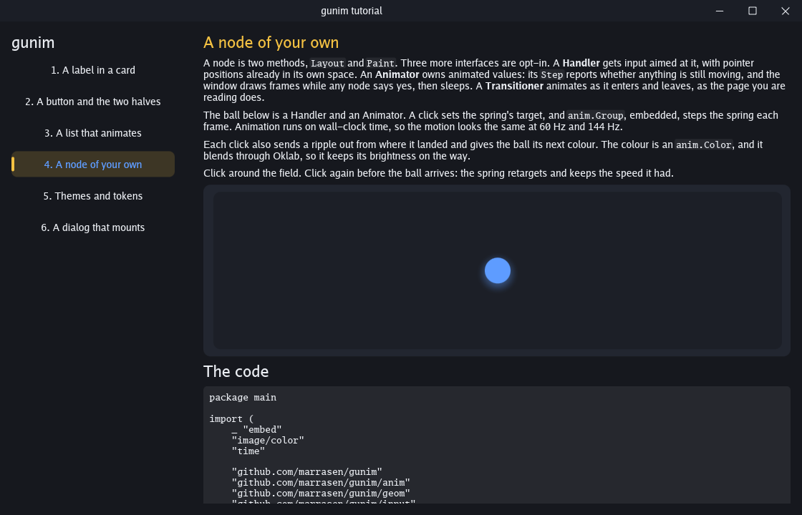

# Building a gunim app

This is a tutorial in two forms. Run it, and each lesson is a page in a
window with something to try and its own source underneath, in an
editor. Read it, and this file walks the same six lessons through the
same files.

Change a lesson's source and press **Run**. The tutorial builds again
with that file as edited and opens on that lesson in a window of its
own. A build error marks its line in the editor, and the build's output
slides open below. **Format** tidies the file as gofmt does, and
**Revert** puts it back as it was; Ctrl+Z brings the edits back. Run
needs the Go toolchain, and the tutorial started from the gunim
repository.

```sh
CGO_ENABLED=0 go run ./example/tutorial
CGO_ENABLED=0 go run ./example/tutorial -lesson 4
```



The files:

| File | What it is |
| --- | --- |
| `main.go` | The window, the application half, and the table of lessons |
| `shell.go` | The lesson list down the left, with a pill that springs between lessons |
| `page.go` | The page each lesson sits on: the intro, the demo, the code editor, and the output |
| `runner.go` | Run: building the tutorial with an edited file through `go build -overlay`, and running it |
| `lesson1.go` to `lesson6.go` | One lesson each: its view, its vocabulary, and its part of the application half |
| `app_test.go` | How to test both halves offscreen, a frame at a time |

## The shape of a gunim program

A gunim program is two halves that speak only in values.

The **window half** owns the nodes: the widget tree, the springs, the
focus ring. It runs on the window's own goroutine, and that goroutine
is the only thing that touches nodes.

The **application half** owns the work: the state, the files, the
network. It runs on a goroutine of its own and reaches the window
through a `Client`, whose methods take values and return at once.

Between them run **commands** one way and **intents** the other. A
command is `Mount`, `Update`, `Publish`, `Patch`, `Unmount`, `Focus` or
`SetTheme`. An intent is any value a widget sends when the user does
something. Both are plain Go values, so the same types serve both
halves, and a socket could carry them to another machine with neither
half changed.

`main.go` has the whole skeleton:

```go
gunim.Main(ctx, func(a *gunim.App) error {
    w, err := a.NewWindow(gunim.WindowOptions{
        Title: "gunim tutorial",
        Size:  geom.Sz(1080, 720),
        Root:  widget.NewSurface(),
    })
    if err != nil {
        return err
    }
    registerViews(w)        // the window half
    return serve(ctx, w.Client(), start)  // the application half
})
```

`gunim.Main` starts the platform's event loop on the main goroutine,
which X11, Win32 and Cocoa all insist on, and runs your function beside
it. `NewWindow` opens a window with a root node. A `Surface` fills it
with the theme's background and stacks the mounted views over it.

`serve` is the application half, and it is a loop:

```go
for {
    select {
    case <-ctx.Done():
        return nil
    case ev, ok := <-c.Intents():
        if !ok {
            return c.Err()
        }
        // carry the intent out, then
        _ = c.Update("page", state)
    }
}
```

## Lesson 1: a label in a card

`lesson1.go`

A window holds a tree of nodes. A `Node` is two methods. `Layout`
measures the node within the constraints it is given and places its
children. `Paint` records how it looks. The engine calls both once per
frame.

The `widget` package has the everyday nodes. `Row` and `Column` lay
children out along a line with the theme's gap between them, and
`Grow` gives one child the space the others leave:

```go
spacer := widget.NewSpacer()
ends := widget.Row(left, spacer, right).Grow(spacer, 1)
col := widget.Column(heading, body, ends)
col.Cross = widget.CrossStretch
```

`NewCard` paints a rounded panel behind its child and `NewPad` adds a
margin. A `Label` wraps to the width it is given. The row of coloured
swatches is six cards, each wearing a theme of its own that sets its
fill, sharing the width with `Grow`.

A view is how the application names a subtree. `RegisterView` gives it
a name, a build function that makes the nodes from the first state,
and an update function that refreshes them from later state. This
lesson is static, so its state type is `struct{}` and its update
function is nil:

```go
gunim.RegisterView(w, "lesson1", buildLesson1, nil)
```

## Lesson 2: a button, and the two halves

`lesson2.go`

The lesson's vocabulary is three types the halves share:

```go
type (
    Counter struct{ Clicks int }  // what the view shows
    Clicked struct{}              // travels when the button is pressed
    Reset   struct{}              // travels when the count goes back to zero
)
```

Each is registered with a name for the wire. In one process values
cross as they are, and the name is what a socket would carry beside
each one:

```go
gunim.RegisterType[Counter]("tutorial.counter")
```

A button's `On` field is the intent it sends when pressed. It is a
value, so the wiring is data:

```go
press := widget.NewButton("Press me")
press.On = Clicked{}
```

The application hears it on `Client.Intents`, changes its state, and
hands the view fresh state with `Client.Update`. In this program each
lesson's `Handle` function is its slice of the application half:

```go
Handle: func(a *app, _ gunim.Client, in gunim.Intent) bool {
    switch in.(type) {
    case Clicked:
        a.clicks++
    case Reset:
        a.clicks = 0
    default:
        return false
    }
    return true
},
```

The view's update function turns the state into what the nodes show.
It runs straight after the build, and again on every `Update`:

```go
func (p *counterPage) show(s Counter, u *gunim.UI) {
    p.count.Text = fmt.Sprintf("Pressed %d times", s.Clicks)
    u.Invalidate()
}
```

The `*gunim.UI` is the window's goroutine speaking: it animates with
the theme's motion, inserts and removes nodes, moves focus, and marks
the frame for drawing.

The update function is also where a change gets its motion. When the
count changes, the view gives the label a bump: `bump` is a small node
that paints its child through a scale, and `Bump` kicks the scale up
and lets the theme's bounce bring it back:

```go
func (b *bump) Bump(u *gunim.UI) {
    b.scale.Jump(1.35)
    b.scale.Animate(1, widget.Bounce.Get(u.Theme()))
}

func (b *bump) Paint(p *paint.Painter, _ gunim.Frame, box geom.Size, kids gunim.Children) {
    defer p.Push(paint.Scale(b.scale.Value(), geom.Pt(0, box.H/2)))()
    kids.At(0).Paint(p)
}
```

## Lesson 3: a list that animates

`lesson3.go`

The application publishes the whole list every time. `widget.Sync`
compares it with the rows on screen by key, so it knows which row is
new, which is gone, and which moved. A new row grows in, a gone row
collapses while its neighbours close the gap, and the rest spring to
their new places:

```go
widget.Sync(p.list, u, s.Items,
    func(it Item) widget.Key { return widget.Key(strconv.Itoa(it.ID)) },
    newRow, nil)
```

The key is the item's ID. Keep IDs stable and rows keep their identity
through every change.

A text field's `OnSubmit` turns what was typed into an intent.
Emptying the field is local to the window, so it happens in the same
closure, on the way out:

```go
field.OnSubmit = func(text string) gunim.Intent {
    field.SetText("", nil)
    return Added{Text: text}
}
```

Sending a value hands it over, so the state carries a clone of the
list and the application keeps its own:

```go
State: func(a *app) any { return Todo{Items: slices.Clone(a.items)} },
```

## Lesson 4: a node of your own

`lesson4.go`

`Node` is `Layout` and `Paint`. Three more interfaces are opt-in:

- A `Handler` gets input aimed at it. Pointer positions arrive in its
  own space. Return true to keep the event, false to offer it to the
  parent.
- An `Animator` owns animated values. Its `Step` reports whether
  anything is still moving, and the window draws frames while any node
  says yes, then sleeps. Embedding `anim.Group` gives a node `Step` for
  free.
- A `Transitioner` animates as it enters and leaves. The page in
  `shell.go` is one.

The lesson's ball field is a Handler and an Animator:

```go
type ballField struct {
    anim.Group
    at   *anim.Point
    laid bool
}

func (b *ballField) Handle(e input.Event, u *gunim.UI) bool {
    if e, ok := e.(input.PointerDown); ok && e.Button == input.ButtonPrimary {
        b.at.Animate(e.Pos, widget.Bounce.Get(u.Theme()))
        return true
    }
    return false
}
```

`Paint` reads the spring's value each frame and draws the ball there.
Animation runs on wall-clock time, so the motion looks the same at
60 Hz and 144 Hz. Click again before the ball arrives and the spring
retargets with the speed it had.

A click also starts two more values. The ball's colour is an
`anim.Color` that blends to the next hue through Oklab, so it keeps its
brightness on the way. A ripple is an `anim.Float` run from 0 to 1 on a
tween, and `Paint` draws a ring that grows and thins with it:

```go
b.tint.Animate(hueColors[b.clicks%len(hueColors)], widget.Settle.Get(th))
b.ripple.Jump(0)
b.ripple.Animate(1, anim.Tween{Duration: 600 * time.Millisecond})
```

Springs and tweens both satisfy `anim.Motion`. A spring suits a value
that may be retargeted mid-flight, as the ball is; a tween suits a
one-shot effect with a fixed length, as the ripple is.

Everything in this lesson stays in the window. The application hears
nothing, which is right for motion that belongs to the interface.

## Lesson 5: themes and tokens

`lesson5.go`

A theme sets how widgets look and move: colours, paddings, radii,
fonts, text sizes and springs. A widget declares each value as a token
with a default and reads it every frame:

```go
var bigText = theme.Length("tutorial.big", 28)

big := widget.NewLabel("Big text")
big.Size = bigText
```

A theme gives tokens values, and the window keeps one animated value
per token. `main.go` registers the two themes the switch moves
between, and adds this program's own token to the light one:

```go
w.RegisterTheme(widget.Dark())
w.RegisterTheme(widget.Light().With(theme.Set(bigText, 36)))
```

Switching retargets every token at once, so colours, sizes and motion
move together, and a button half way into its hover colour carries on
from where it is:

```go
_ = c.SetTheme("light")
```

A subtree can wear a theme of its own with `widget.NewThemed`. It sets
the tokens it names and takes the rest from the theme around it.

The switch's update is `SetChecked`, which puts it where the state says
without sending an intent. Every control has such a method for a
view's update function to call.

## Lesson 6: a dialog that mounts

`lesson6.go`

The application puts a view on screen with `Client.Mount`, naming the
parent, an ID, the view and its state. The dialog is a view of its own,
mounted at the root so it floats over the page:

```go
gunim.RegisterView(w, "confirm", func(s Confirm) *widget.Dialog {
    d := widget.NewDialog(fmt.Sprintf("Delete %d files for good?", s.Files))
    d.Danger = true
    d.SetButtons("Empty the trash", "Keep them")
    d.Accept, d.Dismiss = Emptied{}, Kept{}
    return d
}, nil)

_ = c.Mount(gunim.Root, "confirm", "confirm", Confirm{Files: a.trash})
_ = c.Focus("confirm")
```

Local interaction stays local. The dialog closes itself on the frame
its button is released, and tells the application afterwards with
`Accept` or `Dismiss`. The application changes its state and the page
below updates.

`Client.Unmount` starts a view's exit. The node stays in the tree while
it animates out, and the engine unlinks it once its `Transition`
reports settled. Switching lessons in this window works that way: the
shell unmounts the page and mounts the next under the same ID, and the
two cross over.

The shell says where mounted views go with one method:

```go
func (s *shell) Slot() gunim.Node { return s.body }
```

Once the trash is emptied, the view sends a ring out past the window's
edges onto the desktop with `widget.Echo`, drawn in a popup larger than
the window. The view sees the files go from some to none in its update
function, so the ping is its call, and the application stays out of it.

## Testing both halves

`app_test.go`

The application half is plain Go: call a lesson's `Handle` and look at
the state.

The window half runs offscreen. `gunimtest.New` opens a window with no
display, and `Window.Frame` draws one frame with a chosen delta, so a
test steps an animation a frame at a time and can assert on every
frame:

```go
w := gunimtest.New(t, geom.Sz(1080, 720), widget.NewSurface())
registerViews(w)
c := w.Client()
_ = c.Mount(gunim.Root, "shell", "shell", Shell{})
w.Frame(time.Second / 60)
```

`Window.Input` feeds it pointer and key events, and `Client.Intents`
gives back what the widgets sent. A test reaches a view's nodes through
a patch, which runs on the window's goroutine, where nodes belong.

## Running edited code

`page.go` and `runner.go`

The page's editor is a `widget.CodeEditor`, the editor a gunim IDE
would use. Its `Highlight` is `syntax.Go`, and each edit goes to the
application as an intent:

```go
p.code = widget.NewCodeEditor()
p.code.SetText(source, nil)
p.code.OnChange = func(s string) gunim.Intent { return Edited{Lesson: i, Source: s} }
```

The application keeps every lesson's edited source, so an edit
survives a trip to another lesson. When Run is pressed, the runner
builds the tutorial with `go build -overlay`, which puts the edited
source in place of the file on disk for that one build, and runs the
result. The runner is work, so it belongs to the application half. It
reports on a channel, and `serve` reads that channel beside
`Client.Intents`:

```go
select {
case ev := <-a.events:  // the runner
    a.ran(c, ev)
case ev := <-c.Intents():  // the window
    a.handle(c, ev.Intent)
}
```

A build's errors become `widget.CodeMark`s, and the page hands them to
the editor with `SetMarks`. Each fades in on its line, with its
message after the code.

The page's two patches, `Code` and `RunState`, are registered once for
every lesson's view. Each lesson's root is built on a page, and the
patch reaches the page through a small interface:

```go
gunim.RegisterPatch(w, view, func(n paged, r RunState, u *gunim.UI) { n.thePage().showRun(r, u) })
```

## Starting your own

Copy `main.go`, keep `run` and `serve`, and replace the lessons with
your views. The steps are always the same:

1. Declare the values the halves share: a state type per view, and an
   intent type per thing the user can do. Register each with
   `RegisterType`.
2. Register each view with `RegisterView`: a build function and an
   update function.
3. Mount the views from the application, and update them as the state
   changes.
4. Read intents in a loop and carry them out.

The other examples build on this. `example/widgets` is a gallery of
what the widget package has, `example/calculator` shows how far
animation can go, and `example/files` is a full program with real work
in the background.
