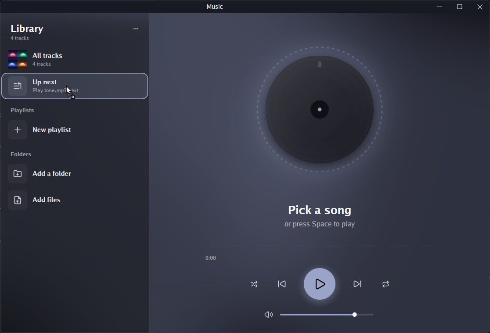
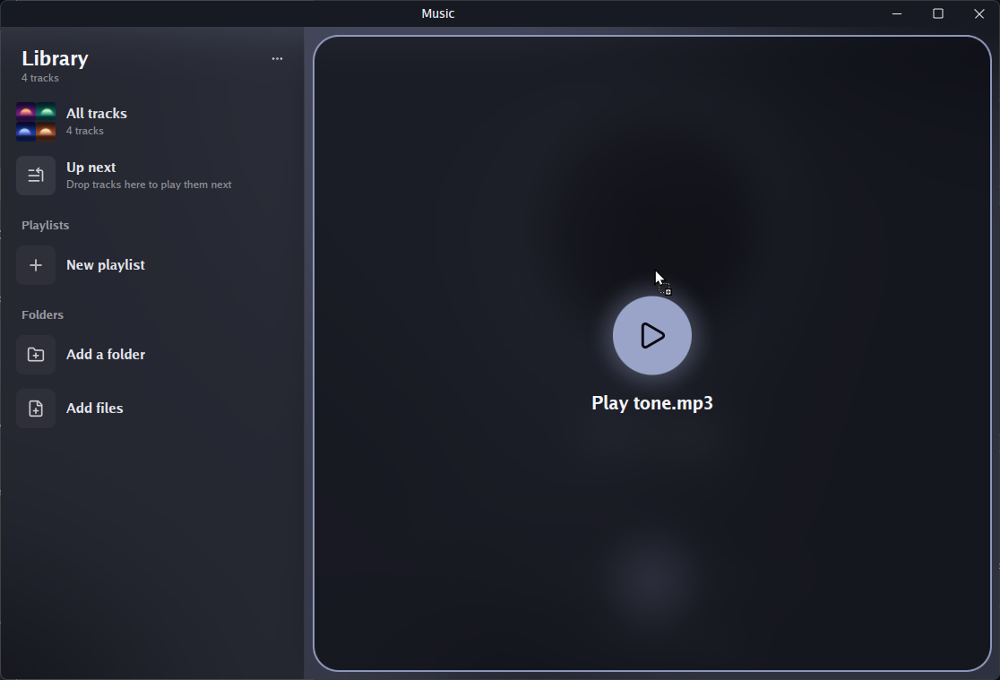
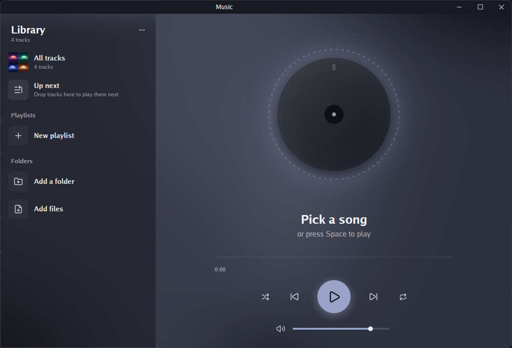
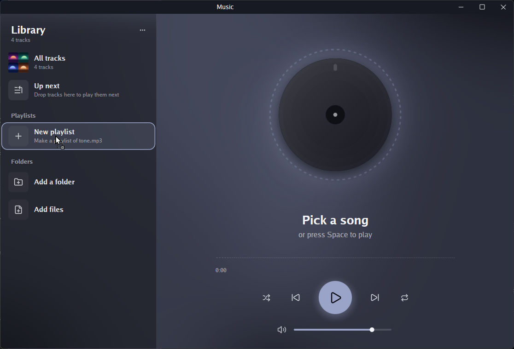
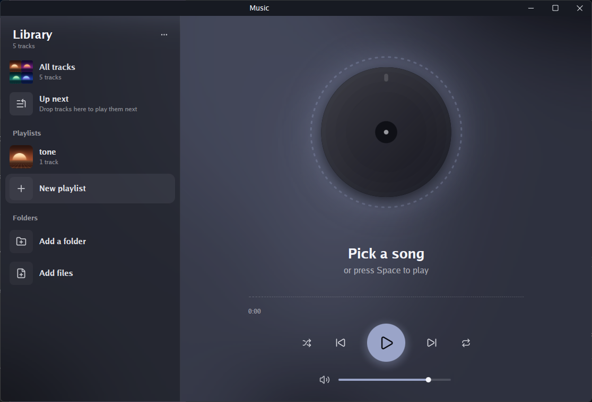
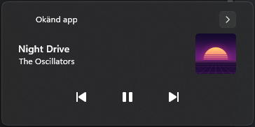
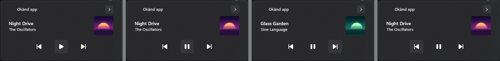
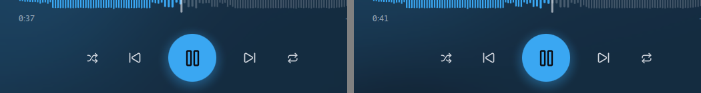

# Issue #23: drag-in, the media panel and resting windows, on music-library

Machine: MSI MPG Infinite X2 13FTD, Windows 11 Home 10.0.26300,
i7-13700KF, NVIDIA GeForce RTX 3070, one monitor at 5120x1440, 120 Hz,
100% scale (the monitor was on). Go 1.27.1, `CGO_ENABLED=0`.
**Commit tested: `3a99253`** (music-library). Input was synthesized
(`SetCursorPos`, `mouse_event`, `keybd_event` with scan codes).

| Check | Result |
|---|---|
| `go test ./...` | **Fail**: two tests in `example/music`; fixed in #24 |
| 1. Files dragged in from Explorer | **Pass** |
| 2. The media panel | **Pass**, with one note: the panel names the app "Unknown app" |
| 3. Covered whole by another window | **Pass**, with one note: the first try logged nothing; 7 later tries all logged correctly |
| 4. Another virtual desktop | **Pass** |

**Setup note.** `-state $env:TEMP\music-state.json` alone did not keep
my own music out. With no state file, the player adds
`%USERPROFILE%\Music` on first run (`serve` in `app.go`). I started it
each time from a state file listing no folders,
`{"Folders":[],"Files":[],"Playlists":[]}`, so it held the four demo
songs only.

In check 3, a window of my own stood in for Notepad: a plain WinForms
window, maximized and restored with `ShowWindow`. Notepad was already
open with my own documents, so I left it alone.

## go test ./...: fail, fixed in #24

    --- FAIL: TestATrackDeletedLeavesTheLibraryButPlaysOn (1.92s)
        library_test.go:200: remove ...\one.mp3: The process cannot access the file because it is being used by another process.
    --- FAIL: TestFilesDroppedToPlayStartOnceRead (2.14s)
        testing.go:1617: TempDir RemoveAll cleanup: unlinkat ...\one.mp3: The process cannot access the file because it is being used by another process.

Both fail the same way when run alone. The player keeps a track's file
open while it plays, and `os.Open` on Windows doesn't let anyone delete
an open file. PR #24 opens it with delete sharing on Windows. With that,
both tests pass, and so does `go test ./...` in full.
`TestWindowOpensAtItsPlacement` passed, both side by side and alone.
Every other package passed.

## 1. Files dragged in from Explorer: pass

I dragged `tone.mp3` from an Explorer folder slowly over the player and
paused at each target, capturing the player with the cursor drawn in.

- **Over Up next,** while held: the row is ringed and reads `Play
  tone.mp3 next`, and the cursor shows Explorer's copy badge.

  
- **Over the big area on the right,** while held: a frame grows round
  it, blurring the turntable behind, and reads `Play tone.mp3`.

  
- **Dragged out of the window:** both lights are out.

  
- **Over New playlist** the row lights with `Make a playlist of
  tone.mp3`. Dropped there, it makes a playlist **`tone`, 1 track**.

  
  

Log: [music-check1.log](music-check1.log).

## 2. The media panel: pass

I pressed Space to play the first song, then opened the panel with Win+A.

- It shows **Night Drive by The Oscillators** with its purple cover.
  **It names the app "Okänd app" (Unknown app)**, not "Music".

  
- **Pause, Play, Next and Previous all work the player.** Below, the
  panel after each press: Play shows after Pause, Pause after Play, Glass
  Garden by Sine Language after Next, and Night Drive again after
  Previous. The log has `button 1`, `button 0`, `button 6` and
  `button 7`, then `showing "Glass Garden"` and `showing "Night Drive"`.

  
- **The play/pause key works with another window focused.** I sent
  `VK_MEDIA_PLAY_PAUSE` twice with my test window in front: `button 1`,
  then `button 0`. It was synthesized, not pressed on a keyboard.
- **No timeline:** this panel shows none, so the drag-the-timeline part
  couldn't be checked.

While binding, the media log has eight `asked for {…}, not given` lines
for the button and seek handlers. Playback and the buttons work anyway.
They're in [music.log](music.log).

## 3. Covered whole by another window: pass, one miss at first

With a song playing, I maximized my test window over the player, waited
2 s, and restored it to 420×300, covering part of the player.

- **The first try logged nothing,** neither `true` nor `false`.
- **The next 7 tries each logged exactly one `out of sight true` on
  maximizing and one `out of sight false` on restoring,** all for the same
  window (`0x2f49cdf7c588`). The partly covering window then logged
  nothing more. The 7 tries were: 3 repeats; 2 with a freshly opened test
  window; 1 right after opening and closing Quick Settings, as the first
  try had been; and 1 while I repeated the walk of the window stack from
  outside, which agreed that the maximized window covers the player whole.
- The music played throughout. Two captures 4 s apart show 0:37 and 0:41,
  and the log has no pause apart from my own presses.

  

I couldn't reproduce the first miss and didn't look into it further.

## 4. Another virtual desktop: pass

With the player in front, Win+Ctrl+D took me to a new desktop and the
player logged `out of sight true`. My first Win+Ctrl+Left didn't switch
back; I had pressed Win before Ctrl. The second, Ctrl first, did, and
the player logged `out of sight false`. Closing the extra desktop
(Win+Ctrl+Right, then Win+Ctrl+F4) logged one more `true` and `false`.
The music played throughout, moving on to the next track as the first
ended.

Log: [music.log](music.log), which also holds checks 2 and 3.
