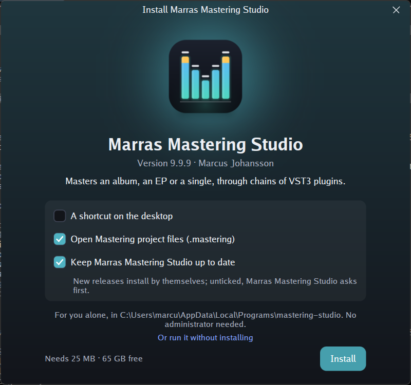
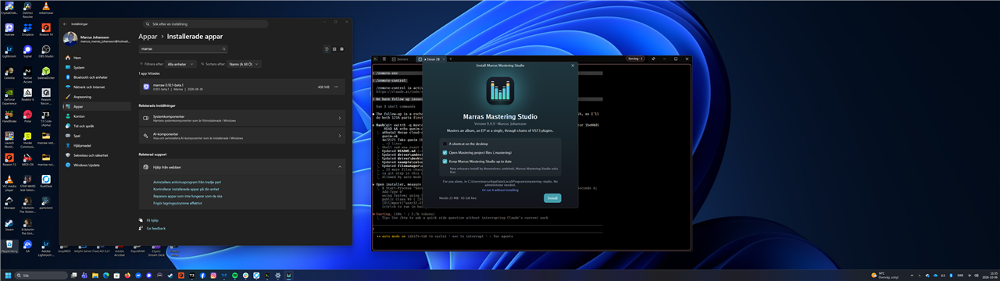

# Windows: recheck of the update and placement fixes (#28)

## Machine

- Windows 11 Home 10.0.26300
- NVIDIA GeForce RTX 3070, driver 32.0.15.8157
- One monitor, 5120×1440 at 119 Hz, task bar at the bottom. At 125% the
  work area is 5120×1380 physical; at 100% it is 5120×1392.
- go1.27.1 windows/amd64
- gunim master at `a6ba4a3` (contains `1be80d5`)
- mastering-studio main at `4e72171`, which builds against gunim `1be80d5`

## Summary

| Check | Result |
|---|---|
| 1. Tests at 100% and 125% | **Pass** |
| 2. Installer centred at 125% | **Pass**, offset 0 px |

## 1. Tests at 100% and 125%: pass

I ran `go test -count=1 -v ./install/ ./driver/desktop/` at each scale.
Both packages pass at both scales, including `TestABadUpdateGivesWay`
and `TestAChromelessWindowOpensInTheMiddle`.

- 125%: [1-test-125.log](1-test-125.log)
- 100%: [1-test-100.log](1-test-100.log)

## 2. Installer centred at 125%: pass

The release build ran from Downloads, at 125% with the task bar at the
bottom.

- `GetWindowRect` and DWM's extended frame bounds agree: (2160, 315)–(2960, 1065).
- The window's middle is **(2560, 690)**.
- The work area is (0, 0)–(5120, 1380), so its middle is **(2560, 690)**.
- The offset is 0 px in both directions. Before the fix it was
  (−9, −38).

Whole monitor, scaled down to 1280×360:

The installer was closed without installing, and the build was deleted.
