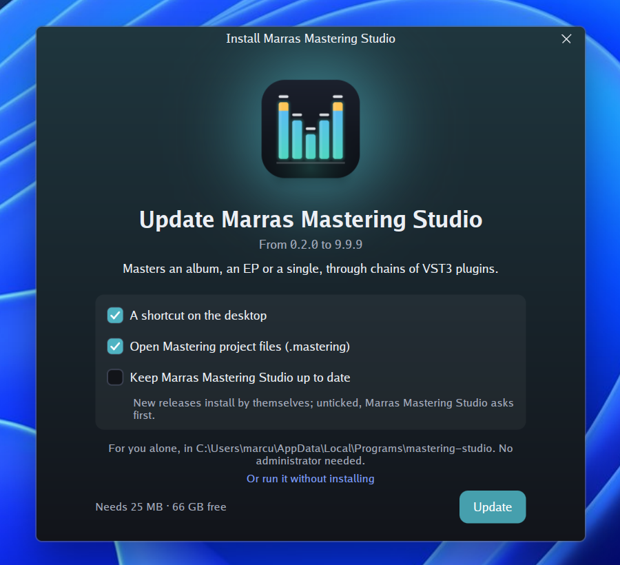
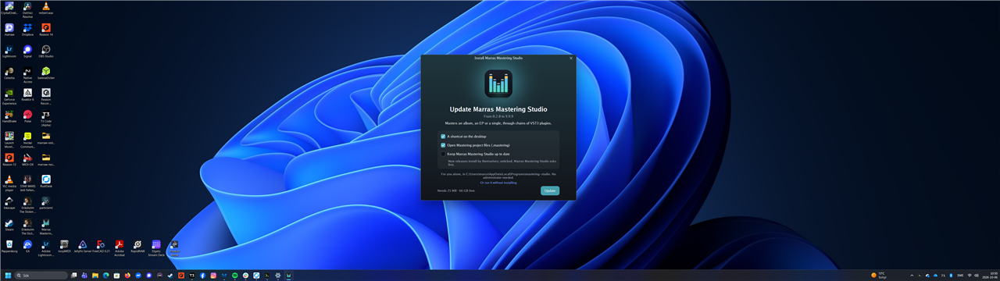

# Windows: installer update, shortcut and uninstall fixes (#28)

## Machine

- Windows 11 Home 10.0.26300
- NVIDIA GeForce RTX 3070, driver 32.0.15.8157
- One monitor, 5120×1440 at 119 Hz. It was at 100% with the task bar
  on a side; for checks 2–4 it was at 125%, task bar at the bottom
  (work area 5120×1380 physical).
- go1.27.1 windows/amd64, golangci-lint 2.14.0
- gunim master at `dd2c6e3` (contains `a7e8663`)
- mastering-studio main at `3c87f31` (contains `5d28746`), which builds
  against gunim `8e1a017` from its `go.mod`, not the local checkout

Version 0.2.0 of the studio was installed before the run, so check 3
was an update from 0.2.0 to 9.9.9 rather than a fresh install.

## Summary

| Check | Result |
|---|---|
| 1. Tests and lint | **Fail**: 5 update tests, 1 placement test, 30 lint issues; `TestReplacePastARunningOld` passes |
| 2. Installer window clears the task bar | **Pass**, but the window sits 38 px above the middle |
| 3. Install rewrites an old shortcut | **Pass** |
| 4. Uninstall waits, then removes it all | **Pass**, folder gone 0.1 s after the uninstaller exited |

## 1. Tests and lint: fail

`go test -count=1 ./install/ ./driver/desktop/`. Full verbose output:
[1-test-install.log](1-test-install.log),
[1-test-desktop.log](1-test-desktop.log).

`TestReplacePastARunningOld` passes.

Five tests in `install` fail, all with the same message. They fail the
same way on every run.

```
--- FAIL: TestABadUpdateGivesWay
    update_test.go:476: staged, studio.exe.old holds "", want "one"
--- FAIL: TestAGoodUpdatePasses
    update_test.go:518: staged, studio.exe.old holds "", want "one"
--- FAIL: TestANewerReleaseOnTrialKeepsTheOneThatPassed
    update_test.go:573: staged, studio.exe.old holds "", want "one"
--- FAIL: TestAFailedDownloadOnTrialChangesNothing
    update_test.go:604: staged, studio.exe.old holds "", want "one"
--- FAIL: TestTheProgramBeingReplacedLeavesTheTrial
    update_test.go:635: staged, studio.exe.old holds "", want "one"
```

In `driver/desktop`, `TestWindowOpensAtItsPlacement` passes, both in the
full run and on its own. `TestAChromelessWindowOpensInTheMiddle` fails
in the full run and also on its own with `-run`:

```
--- FAIL: TestAChromelessWindowOpensInTheMiddle (3.07s)
    placement_test.go:149: the window's middle is at {2552 539}, want the work area's, {2560 570}
```

At that point the monitor was at 100% with the task bar on a side.

`golangci-lint run ./install/...` reports 30 issues
([1-lint.log](1-lint.log)): dupword 1, exhaustive 3, gocritic 9,
govet 6, noctx 3, perfsprint 1, prealloc 1, revive 2, unparam 2,
unused 2. Three of them are in `system_windows.go`. I didn't check
whether the others also show up on other platforms.

## 2. The installer window clears the task bar: pass, with a note

At 125% with the task bar at the bottom, the release build ran from
Downloads.

- It opened on the monitor under the pointer (the only monitor).
- The window spans (2151, 277)–(2951, 1027) in physical pixels. The work
  area ends at y = 1380, so the whole footer and the Update button are
  visible, 353 px clear of the task bar.
- The window's middle is at (2551, 652), but the work area's is
  (2560, 690). The window sits 38 px too high and 9 px too far left.
  That is the same kind of offset `TestAChromelessWindowOpensInTheMiddle`
  reports in check 1.



Whole monitor, scaled down to 1280×360:



## 3. Install rewrites an old Start menu shortcut: pass

- Before: `Marras Mastering Studio.lnk` pointed at
  `C:\Users\marcu\AppData\Local\Programs\mastering-studio\mastering-studio.exe`
  (from 0.2.0). It was set to `C:\Windows\notepad.exe`.
- Pressed Update, then Close.
- After: the target is
  `C:\Users\marcu\AppData\Local\Programs\mastering-studio\mastering-studio.exe`.
- The uninstall entry is `Marras Mastering Studio`, `DisplayVersion`
  9.9.9, `UninstallString`
  `"...\mastering-studio\mastering-studio.exe" -uninstall`.
- `install.json` has version 9.9.9.

## 4. Uninstall waits for the running program, then removes it all: pass

1. The studio was started from its Start menu shortcut at 10:53:40 and
   the uninstall from Settings at 10:55:08 (pid 56088,
   `mastering-studio.exe -uninstall`). The uninstaller said the studio
   was running and waited.
2. When the studio window was closed, the uninstall went on by itself
   and showed its "removed" message.
3. While the "removed" window was open, only `mastering-studio.exe`
   (the running uninstaller) was left in the folder. `LICENSE` and
   `NOTICE` were gone. The uninstaller exited at 11:04:14.981, and the
   folder was gone at 11:04:15.115, **0.1 s later**.
4. The Start menu shortcut, the desktop shortcut and the uninstall entry
   are gone.

I have no screenshot of the "studio is running" message. Step 1 relies
on what the person at the machine saw. My process log missed the moment
the studio exited, so I don't know how long the uninstall took after the
studio closed.

The build was deleted from Downloads afterwards.
